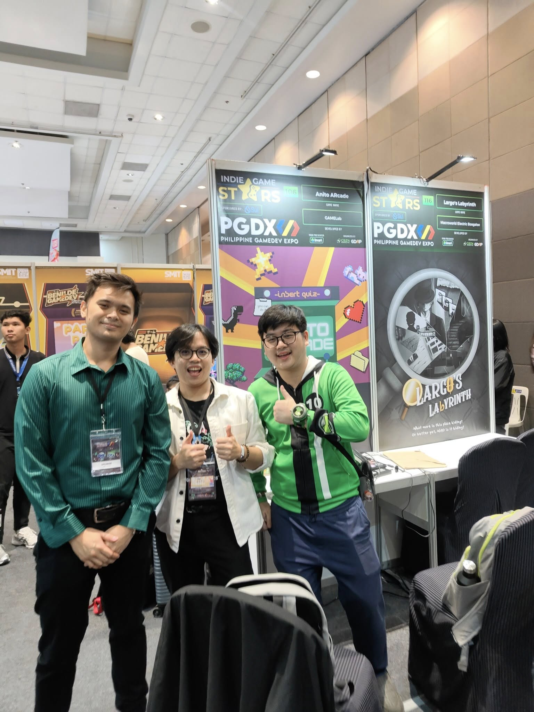
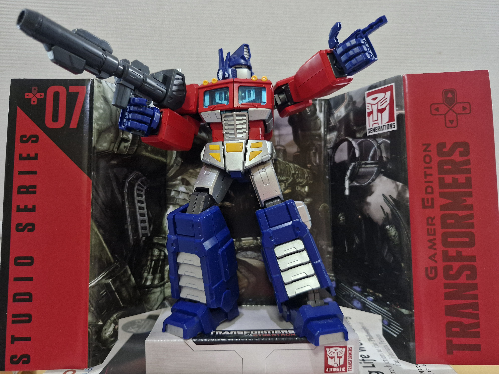
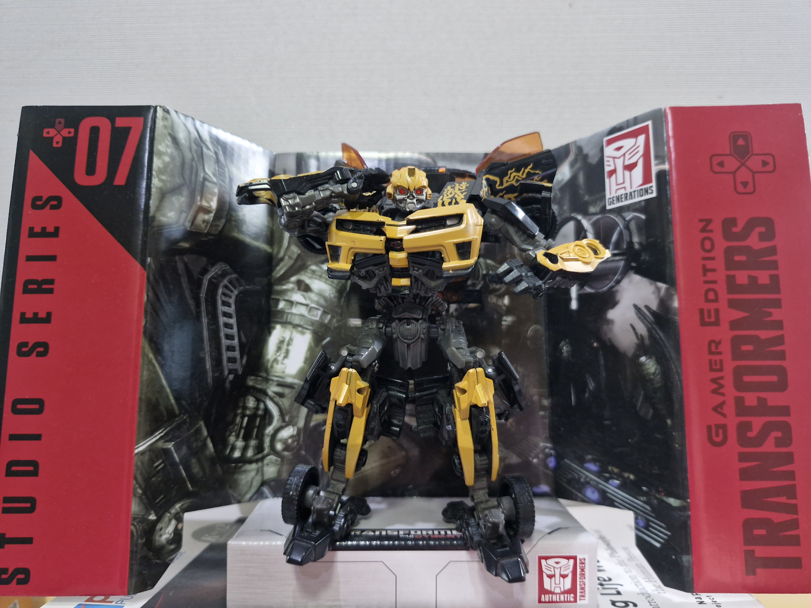
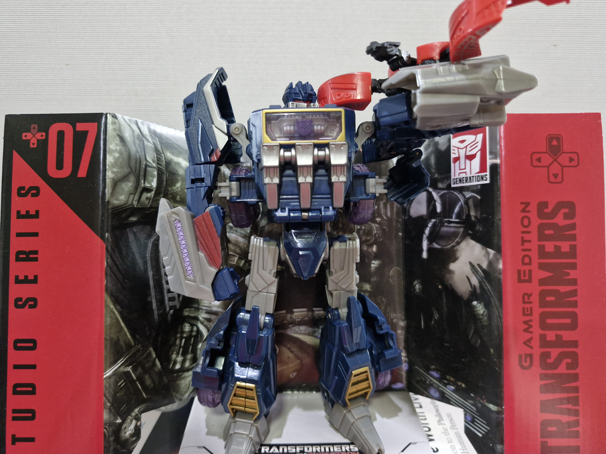
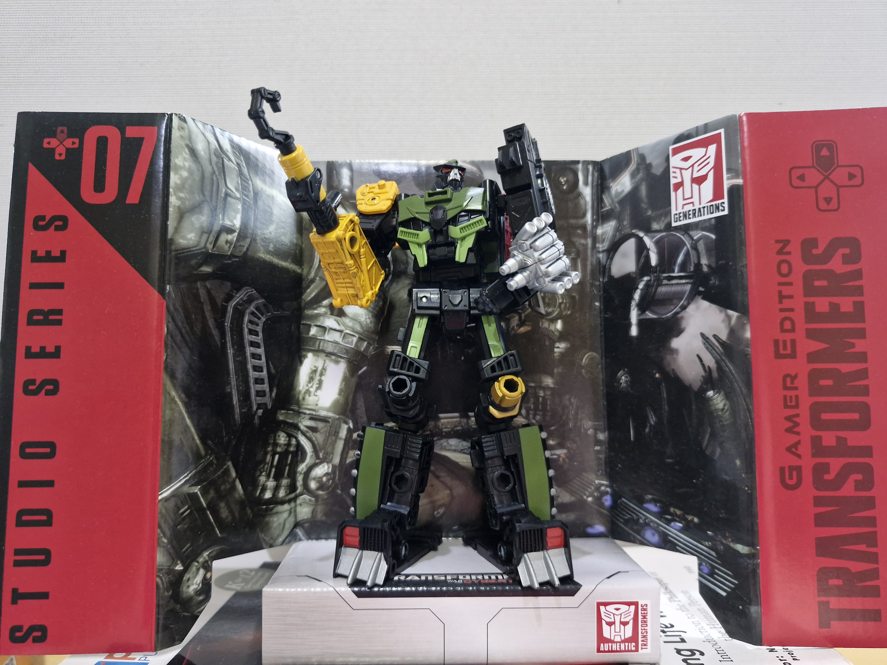
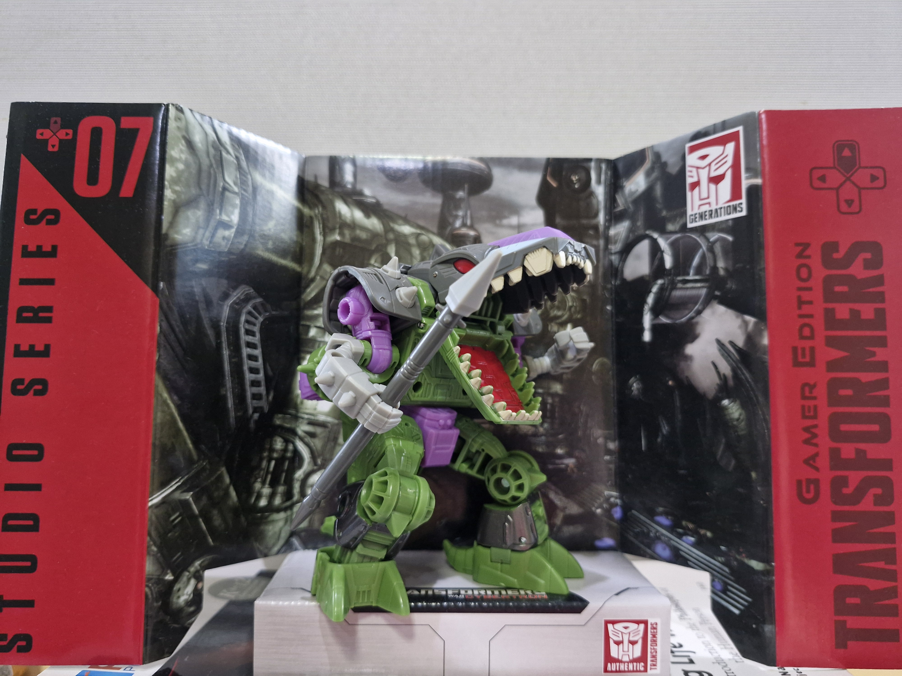

# 
 Kevin Shu Too
### 
Contact thru: kevin_l_shutoo@dlsu.edu.ph

 

## WHO AM I?

 Creative and adaptable Game Developer with experience in C#, C++, Unity, and Unreal Engine 5. Experienced and knowledgeable in various game development skills ranging from coding to animation. Seeking to further develop my technical and problem-solving skills. Passionate about creating and developing games people can enjoy and immerse themselves with as well as remember fondly. Even more fond of Transformers, Pokemon, Ben 10, and Arknights. 

 

# 
 CERTIFICATIONS

  
  

 

# Education
*De La Salle University*
 - **Senior High School - Science Technology Engineering Math**    (2017 - 2019)

*De La Salle University*
 - **BS Interactive Entertainment Technologies**    (2019 - current)
 - Major: Game Development

 

# Academic Projects

### Previews

  
  
  
  
  <!-- Add more images as needed -->

 

## Semester Saga by More Boullets Studios  (2023 - 2024)
**Role**: Engineer
 - Worked on developing a school-based RPG game as an engineer and programmer
 - Created and assisted with minigames
 - Created working animations using assets from the arts and design team
 - Created, worked on, and assisted with various scripts and components that affect game mechanics like in-game stats, time, event systems, and animations

  <video src="Unity/Semester Saga/Semester Saga Short Gameplay Video.mp4" controls style="width: auto; height: 400px; margin-right: 10px; display: inline-block;"></video>
  <video src="Unity/Semester Saga/Animation Clip.mp4" controls style="width: auto; height: 400px; margin-right: 10px; display: inline-block;"></video>
  <video src="Unity/Semester Saga/Minigame Clip.mp4" controls style="width: auto; height: 400px; margin-right: 10px; display: inline-block;"></video>

 

## Farming Sim  (2024)
**Role**: Engineer
 - Worked on a farming simulation game for a info management class that uses databases
 - Worked on the UI and inventory system
 - Makes use of Unity and MySQL

  <video src="Unity/Farm Game/Farm Game.mp4" controls style="width: 800px; height: auto; margin-right: 10px; display: inline-block;"></video>

 

## What Lurks In The Dark  (2025)
**Role**: Engineer
 - Created a 3D sidescroller horror game in Unity set in a school campus with monsters as part of a team
 - Worked on coding the trap and enemy behaviors, scene designs, and team management
 - Itch.io link: <a href="https://hollowscapemedia.itch.io/what-lurks-in-the-dark" target="_blank">What Lurks In The Dark</a>  

  
  <video src="Unity/What Lurks In The Dark/Gameplay.mp4" controls style="width: auto; height: 400px; margin-right: 10px; display: inline-block;"></video>
  <video src="Unity/What Lurks In The Dark/Teaser.mp4" controls style="width: auto; height: 400px; margin-right: 10px; display: inline-block;"></video>

 

## Astro Shork   (2025)
**Role**: Engineer
 - Assisted the team in creating a top-down Vampire Survivors like game of a shark fighting against creatures and asteroids
 - Worked on the enemy and bullet scripting
 - Itch.io link: <a href="https://finalspeedz.itch.io/astro-shork" target="_blank">Astro Shork</a>  

 

## Previous Work Experience

### DLSU GAME Lab   (2025)
**Role**: Intern and Lead Engineer
 - Worked on developing an in-house game engine
 - Worked on an AR mobile application as well as conducted user testing
 - Handle management tasks and organization of files
 - Link to: <a href="https://www.facebook.com/DLSUGAMELab" target="_blank">Facebook Page</a>  

  

 

# TECHNICAL SKILLS
## Preview

  
  
  
  
  
  
  
  
  <!-- Add more images as needed -->

## Clips

  <video src="Unity/AR/AR Tower Defense Prototype.mp4" controls style="width: 800px; height: auto; margin-right: 10px; display: inline-block;"></video>
  <video src="Unity/Semester Saga/Minigame Clip.mp4" controls style="width: 800px; height: auto; margin-right: 10px; display: inline-block;"></video>
  <video src="Unreal Engine/Landscaping/Outdoor/Outdoor Landscaping.mp4" controls style="width: 800px; height: auto; margin-right: 10px; display: inline-block;"></video>

 

<table>
  <thead>
    <tr>
      <th colspan="3" style="text-align: center; background-color: #1f2f4a; color: white;">Technical Skills</th>
    </tr>
    <tr>
      <th>CODING LANGUAGES</th>
      <th>GAME ENGINGES</th>
      <th>OTHER SOFTWARES</th>
    </tr>
  </thead>
  <tbody>
    <tr>
      <td>C#</td>
      <td>Unity</td>
      <td>Visual Studio Code</td>
    </tr>
    <tr>
      <td>C++</td>
      <td>Unreal Engine</td>
      <td>Visual Studio</td>
    </tr>
    <tr>
      <td>C</td>
      <td>Godot</td>
      <td>GIMP & Photoshop</td>
    </tr>
    <tr>
      <td>HTML</td>
      <td>&nbsp;</td>
      <td>AutoCAD</td>
    </tr>
    <tr>
      <td>Python</td>
      <td> </td>
      <td>3ds Max</td>
    </tr>
    <tr>
      <td>&nbsp;</td>
      <td>&nbsp;</td>
      <td>Github</td>
    </tr>
    <tr>
      <td>&nbsp;</td>
      <td>&nbsp;</td>
      <td>MySQL</td>
    </tr>
  </tbody>
</table>

 

<table>
  <thead>
    <tr>
      <th colspan="2" style="text-align: center; background-color: #1f2f4a; color: white;">OTHER INFORMATION</th>
    </tr>
    <tr>
      <th>Category</th>
      <th>&nbsp;</th>
    </tr>
  </thead>
  <tbody>
    <tr>
      <td>Languages</td>
      <td>English, Filipino, Basic Mandarin Chinese</td>
    </tr>
    <tr>
      <td>Soft Skills</td>
      <td>Project Management, Adaptability, Creative Thinking, Administrative Tasks, Quality Testing</td>
    </tr>
    <tr>
      <td>Design Skills</td>
      <td>Creative writing, Story + Narrative, Level Design, Logo + Icon Design, UI</td>
    </tr>
  </tbody>
</table>

# Resume

<iframe src="Doc/Kevin Shu Too CV.pdf" width="100%" height="700px" style="border: none;"></iframe>

 

# Contacts
### Email: kevin_l_shutoo@dlsu.edu.ph
### Link to my: <a href="https://www.linkedin.com/in/kevin-shu-too-b776b233b/" target="_blank">LinkedIn Profile</a>

 

# Personal Collection
## A treat for making it this far down!

  
  
  
  
  

