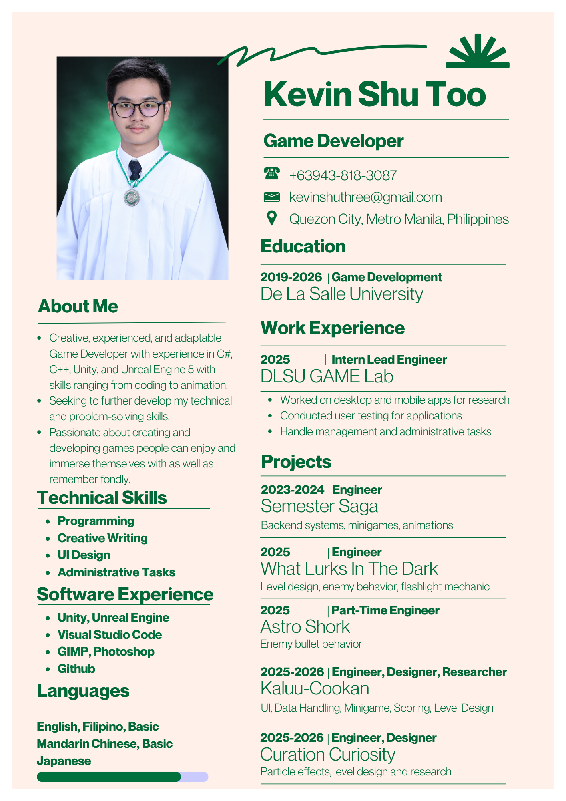
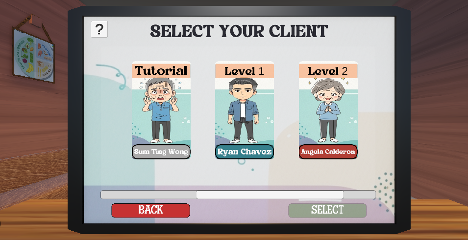

  <a href="#home">Home</a>
  <a href="#projects">Projects</a>
  <a href="#experience">Experience</a>
  <a href="#contact">Contact</a>

---

  <h1>
Kevin Shu Too
</h1>
  
  

    

      <h2 style="text-align: center;">Who Am I?</h2>
      <ul class="intro-text">
        <li>Creative and adaptable Game Developer with experience in C#, C++, Unity, and Unreal Engine 5.</li>
        <li>Experienced in programming, databases, UI, Scriptable Objects, and animation.</li>
        <li>Seeking to further develop technical and problem-solving skills.</li>
        <li>Passionate about creating immersive and memorable games.</li>
        <li>Deeply passionate about Transformers, Pokemon, Ben 10, and Arknights.</li>
      </ul>
    

    

      
    

  

  <h2>Certifications</h2>
  

    
    
  

  <h2>Showcase Gallery</h2>
  

    
    
    
    
  

  <h1 style="text-align: center;">Academic Projects</h1>

  <h3>Semester Saga by More Boullets Studios (2023 - 2024)</h3>
  
<b>Role:</b> Engineer | <b>Tech:</b> Unity, C# | <b>Genre:</b> School Sim RPG

  <ul>
    <li>Created minigames, animations, and scripts for time/event systems.</li>
    <li><a href="https://drive.google.com/drive/folders/1okrHnOI2sQgRrplz9Dnf2-Sy_4tCZldm?usp=drive_link" target="_blank">View Build & Source</a></li>
  </ul>
  

    
    <video src="Unity/Semester Saga/Semester Saga Short Gameplay Video.mp4" controls></video>
    <video src="Unity/Semester Saga/Animation Clip.mp4" controls></video>
  

  <h3>What Lurks In The Dark (2025)</h3>
  
<b>Role:</b> Engineer | <b>Tech:</b> Unity, C# | <b>Genre:</b> Horror 2D Platformer

  <ul>
    <li>Coded enemy behaviors, scene design, and flashlight mechanics.</li>
    <li><a href="https://github.com/Kenneth2Shu/IEPRFDV-What-Lurks-In-The-Dark" target="_blank">GitHub Repo</a> | <a href="https://hollowscapemedia.itch.io/what-lurks-in-the-dark" target="_blank">Itch.io</a></li>
  </ul>
  

    
    <video src="Unity/Semester Saga/Animation Clip.mp4" controls></video>
  

  <h3>Astro Shork (2025)</h3>
  
<b>Role:</b> Engineer | <b>Tech:</b> Unity, C# | <b>Genre:</b> Arcade

  <ul>
    <li>Enemy and bullet scripting for a Vampire Survivors-like arcade game.</li>
    <li><a href="https://finalspeedz.itch.io/astro-shork" target="_blank">Play on Itch.io</a></li>
  </ul>
  

    
    <video src="Unity/Semester Saga/Animation Clip.mp4" controls></video>
  

  <h3>Kalu-Cookan (2025-2026)</h3>
  
<b>Role:</b> Engineer | <b>Tech:</b> Unity, C# | <b>Genre:</b> Educational Cooking

  <ul>
    <li>Researched nutrition and created recipe systems, UI, and level design.</li>
  </ul>
  

    
    
  

  <h3>Curation Curiosity by Touch Grass Studios (2025)</h3>
  
<b>Role:</b> Engineer | <b>Tech:</b> Unity, C# | <b>Genre:</b> Educational (MATATAG Curriculum)

  <ul>
    <li>Focused on animal classification; handled bug fixing and particle systems.</li>
    <li><a href="https://github.com/loldope19/Curation-Curiosity" target="_blank">GitHub Repo</a> | <a href="https://loldope19.itch.io/curation-curiosity" target="_blank">Itch.io</a></li>
  </ul>

  <h1 style="text-align: center;">Experience & Skills</h1>

  <h3>Professional Experience</h3>
  
<b>DLSU GAME Lab (2025)</b> - Intern and Lead Engineer

  <ul>
    <li>Programmed desktop/mobile research apps and led user testing.</li>
    <li><a href="https://www.facebook.com/DLSUGAMELab" target="_blank">Visit Page</a></li>
  </ul>

  <h3>Technical Expertise</h3>
  

    <h4>Coding Languages</h4>
    <ul>
      <li>C#, C++, C, Python, HTML</li>
      <li>Mandarin (Basic Proficiency)</li>
    </ul>
  

  

    <h4>Game Engines</h4>
    <ul>
      <li>Unity</li>
      <li>Unreal Engine 5</li>
      <li>Godot</li>
    </ul>
  

  

    <h4>Other Softwares</h4>
    <ul>
      <li>Visual Studio / VS Code</li>
      <li>Github / AutoCAD</li>
      <li>GIMP / Photoshop / 3ds Max</li>
    </ul>
  

  <h3>Other Information</h3>
  

    <h4>Education</h4>
    <ul>
      <li><b>De La Salle University</b> - BS Interactive Entertainment Technologies (Major in Game Development), 2019 - 2026</li>
    </ul>
  

  

    <h4>Soft Skills</h4>
    <ul>
      <li>Project Management, Adaptability, Creative Thinking, Quality Testing</li>
    </ul>
  

  

    <h4>Design Skills</h4>
    <ul>
      <li>Creative writing, Narrative Design, Level Design, UI/UX</li>
    </ul>
  

  <h1>Let's Connect</h1>
  
Feel free to reach out for collaborations or inquiries!

  
📧 <b>Email:</b> <a href="mailto:kevinshuthree@gmail.com" style="color: #00d4ff;">kevinshuthree@gmail.com</a>

  
🔗 <b>LinkedIn:</b> <a href="https://www.linkedin.com/in/kevin-shu-too-b776b233b/" target="_blank" style="color: #00d4ff;">Profile Link</a>

